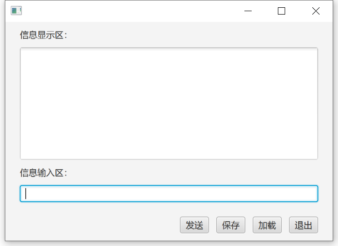

# 第1讲 Java图形窗口程序设计
__教学与实践目的：__
回顾、熟悉和掌握Java图形界面的设计及标准输入输出方法，为后续编程任务奠定基础。

__说明：__
在Java体系中，最常用的图形界面设计库主要是Swing和JavaFX，本课程使用JavaFX，采用手写代码方式创建窗体界面，建议的jdk版本为jdk8（因为jdk8已经内置javaFX库，后续版本被剥离，需要额外下载jar包），oc.our-web.org教学资源站点可下载JDK8。
本课程编程使用的IDE建议为Intellij Idea Community（免费版本）。

## 一、简单的图形界面程序
图形界面如图所示。


__知识点：__
JavaFX布局，TextFiled、TextArea、Button、Label等各控件用法，事件驱动，字符串读写技术，字符流IO

__用户界面__
 该应用程序使用“发送”按钮将信息输入区的内容显示在信息显示区中；“保存”按钮将显示的内容保存到文本文件；“加载”将文本文件内容显示。


### 1. 窗体界面创建
（1）启动Intellij Idea (以后简称 idea），新建项目之前，首先设置默认的编码为utf-8，步骤：file >> setting >> fileEncoding。


（2）新建一个项目，选择“Java”，右方不要勾选任何Additional Libraries and Frameworks，按提示一路next，选择一个合适的项目名完成新建过程，例如NetworkApp，在机房上机时，建议在D盘新建一个自己学号的文件夹，然后把项目建立在该文件夹中，方便管理。下课时将自己的项目文件夹打包带走，然后清理掉文件夹。所有的代码也使用package来管理，例如本章可以在src下新建一个包chapter01，这一讲内容的代码就在这个包下来创建。


（3） 新建javaFX源程序，命名为SimpleFX：鼠标右键点击对应的包chapter01，在弹出菜单中New -> JavaFXApplication，如图1.4所示，然后命名即可。

### 2. 窗体界面相关核心代码
```java
public class SimpleFX extends Application {
  private Button btnExit = new Button("退出");
  private Button btnSend = new Button("发送");
  private Button btnOpen = new Button("加载");
  private Button btnSave = new Button("保存");
  //待发送信息的文本框
  private TextField tfSend = new TextField();
  //显示信息的文本区域
  private TextArea taDisplay = new TextArea();

  public void start(Stage primaryStage) {
    BorderPane mainPane = new BorderPane();
    //内容显示区域
    VBox vBox = new VBox();
    vBox.setSpacing(10);//各控件之间的间隔
    //VBox面板中的内容距离四周的留空区域
    vBox.setPadding(new Insets(10,20,10,20));
    vBox.getChildren().addAll(new Label("信息显示区："),
        taDisplay,new Label("信息输入区："), tfSend);
    //设置显示信息区的文本区域可以纵向自动扩充范围
    VBox.setVgrow(taDisplay, Priority.ALWAYS);
    mainPane.setCenter(vBox);
    //底部按钮区域
    HBox hBox = new HBox();
    hBox.setSpacing(10);
    hBox.setPadding(new Insets(10,20,10,20));
    hBox.setAlignment(Pos.CENTER_RIGHT);
    hBox.getChildren().addAll(btnSend,btnSave,btnOpen,btnExit);
    mainPane.setBottom(hBox);
    Scene scene = new Scene(mainPane,700,400);
    primaryStage.setScene(scene);
    primaryStage.show();

    //事件响应部分
}

```

对于文本区域taDisplay控件，自行查找方案，将其设置为只读和自动换行。
```Java
taDisplay.setEditable(false);
taDisplay.setWrapText(true);
```

该程序中，需要对四个按钮的点击操作进行响应，可使用动作事件，即调用按钮的setOnActon方法，如果事件响应的代码量不大，可以直接在方法的参数中写匿名内部类或lambda表达式，否则就单独写一个内部类，其实例作为方法的参数。
对于“退出”按钮，代码很简单，使用lambda表达式，其参考代码为：

```java
btnExit.setOnAction(event -> {System.exit(0);});
```

“发送”按钮参考代码：
```java
btnSend.setOnAction(event -> {
  String msg = tfSend.getText();
  taDisplay.appendText(msg + "\n");
tfSend.clear();
});
```

请添加文本框tfSend的回车响应功能：文本框中输完内容，回车即可将信息添加到信息显示区；如果是Shift+回车，则在信息前加上 echo:　的信息头再发送。
```Java
tfSend.setOnKeyPressed(new EventHandler<KeyEvent>() {
            @Override
            public void handle(KeyEvent event) {
                if (event.getCode() == KeyCode.ENTER && event.isShiftDown()){
                    shiftSend();
                }else if (event.getCode() == KeyCode.ENTER){
                    send();
                }
            }
        });
```

## 二、信息的文件读写

__信息的文件读写是指将信息显示区的信息保存到文本文件，或从文本文件中读取内容。__

__设计思想：__
新增一个文件操作类，完成文件在磁盘方面的读写功能，并对外提供功能接口。保存和读取的文本文件不应该写死在代码中，而是由用户来选择，可以使用文件对话框（JavaFX中的对话框用法，及文本文件的读写类的选择可参看本讲的附录部分）。
__知识点：__
 IO操作，文件选择框，异常处理，类之间的调用

### 1. 实现流程
（1）新增一个文件操作类TextFileIO，负责文件操作的相关功能，至少实现append方法和load方法用于保存和读取文件；

（2）在SimpleFX类中的合适位置将TextFileIO类实例化为textFileIO，在“保存”按钮的响应事件代码中添加相应功能，代码段如下：
```java
btnSave.setOnAction(event -> {
  //添加当前时间信息进行保存
  textFileIO.append(
      LocalDateTime.now().withNano(0) +" "+ taDisplay.getText());
});
```
（3）在“加载”按钮的响应事件代码中添加相应功能，代码段如下：
```java
btnOpen.setOnAction(event -> {
  String msg = textFileIO.load();
  if(msg != null){
    taDisplay.clear();
    taDisplay.setText(msg);
  }
});
```
### 2. TextFileIO类的核心代码
```java
public class TextFileIO {
  private PrintWriter pw = null;
  private Scanner sc = null;

  public TextFileIO() {
  }

  public void append(String msg) {
    FileChooser fileChooser = new FileChooser();
    File file = fileChooser.showSaveDialog(null);
    if(file == null) //用户放弃操作则返回
      return;
    //以追加模式utf-8的编码模式写到文件中
    try {
      pw = new PrintWriter(
          new OutputStreamWriter(
              new FileOutputStream(file, true), "utf-8"));
      pw.println(msg);
    } catch (Exception e) {
      e.printStackTrace();
    } finally {
      pw.close();
    }
  }

  public String load() {
    FileChooser fileChooser = new FileChooser();
    File file = fileChooser.showOpenDialog(null);
    if(file == null) //用户放弃操作则返回
      return null;
    StringBuilder sb = new StringBuilder();
    try {
      //读和写的编码要注意保持一致
      sc = new Scanner(file,"utf-8");
      while (sc.hasNext()) {
        sb.append(sc.nextLine() + "\n"); //补上行读取的行末尾回车
      }
    } catch (Exception e) {
      e.printStackTrace();
    } finally {
      sc.close();
    }
    return sb.toString();
  }
}
```

这个TextFileIO类的设计其实不太合适，这种封装基础操作的类，应该是可以适用于各种场合，而这个类的操作中使用了窗体的对话框方式，在一些无GUI的控制台环境就无法使用了。大家可以思考这个类如何优化，对应的窗体程序又该如何对应修改。

__IOWithoutGui代码部分__
```Java
\*
修改后命名IOWithouGui
修改部分 将需要窗口操作的全部交由SimpleFX来做，并将file以及msg传入

参数：file：写入的文件地址
      msg：将要写入的字节流（String）
*\
    public void appendTest(File file, String msg){
        try {
            pw = new PrintWriter(
                    new OutputStreamWriter(
                            new FileOutputStream(file, true),"utf-8"));
            pw.println(msg);
        } catch (Exception e) {
            e.printStackTrace();
        } finally {
            pw.close();
        }
    }

    public String loadTest(File file){
        StringBuilder sb = new StringBuilder();
        try {
            //读和写的编码要注意保持一致
            sc = new Scanner(file,"utf-8");
            while (sc.hasNext()) {
                sb.append(sc.nextLine() + "\n"); //补上行读取的行末尾回车
            }
        } catch (Exception e) {
            e.printStackTrace();
        } finally {
            sc.close();
        }
        return sb.toString();
    }

}
```
__SimpleFX修改部分__
```java
btnSave.setOnAction(event -> {
           //添加当前时间信息进行保存
//            textFileIO.append(
//                    LocalDateTime.now().withNano(0) +" "+ taDisplay.getText());
           String msg =  LocalDateTime.now().withNano(0) +" "+ taDisplay.getText();
           FileChooser fileChooser = new FileChooser();
           File file = fileChooser.showSaveDialog(null);
           if(file == null) //用户放弃操作则返回
               return;
           IOWithoutGui.appendTest(file, msg);
       });

       btnOpen.setOnAction(event -> {

//            String msg = textFileIO.load();
//            if(msg != null){
//                taDisplay.clear();
//                taDisplay.setText(msg);
//            }

           FileChooser fileChooser = new FileChooser();
           File file = fileChooser.showOpenDialog(null);
           if(file == null) //用户放弃操作则返回
               return;
           String msg = IOWithoutGui.loadTest(file);
           taDisplay.appendText(msg + "\n");

       });
   }
```
## 三、注意事项
我们会看到不少窗体程序例子，控件类型的变量，例如__Button、TextFiled__等类型变量，是直接定义在__start__方法中，就是成为局部变量，随用随定义。这种情况是因为所有访问该变量的代码都在这个方法中，例如事件响应代码等。
但从设计考虑，可能被多个方法访问的变量，还是类似本讲的方式，定义为成员变量更方便；对于那些不需要再访问的类型，例如__Label__，就选择定义为局部变量。
掌握好本讲的窗体布局、事件响应等知识，后续章节的窗体都是本讲类似界面，只要稍作修改即可。

## 附录
### 1. JavaFX中的对话框
在窗体编程中，对话框使用频率很高，Java 8u40 之后JavaFX才内置有对话框功能，参见JavaFX中对话框.pptx，详细用法可参考慕课网中对应内容的视频：第十四讲 JavaFx中其它的知识点 -> 14.1 JavaFX中的对话框（该课程的加入密码为javagdufs） 。
### 2. 字节流和字符(文本)流
__字节流：__
是8比特一个单元,如键盘输入流、文件输入流、网络输入流，文件输出流、网络输出流等。
支持字节流操作的类有：
OutputStream, FileOutputStream, DataOutputStream 等是字节输出流;
InputStream, FileInputStream, DataInputStream等是字节输入流;

__字符流：__
8/16/32比特一个单元，其长度取决采用何种编码算法，如ISO为32位，GB2312/GBK，utf-8等为16位，ASCII为8位。
支持字符和字符串操作的类有：
InputStreamReader，BufferedReader、Scanner可读字符类,
OutputStreamWriter，PrintWriter可写字符类,
写文本文件最常用的类是PrintWriter，PrintWriter类中有一个常用的println(msg)方法，向输出流中输出一行字符，并自动添加一个行结束符:\n。注意，在使用PrintWriter类时，其虽然可以将文件名作为参数来写文件，但这种用法不能提供追加模式的，所以一般是和FileOutputStream联合使用，例如：
```java
new PrintWriter(new FileOutputStream("temp.txt", true));
```
如果还需要指定文本的编码，并且是追加模式，可以这样联合使用：
```java
new PrintWriter(   
    new OutputStreamWriter(   
        new FileOutputStream("temp.txt",true),  "UTF-8"));  
```
读文件常用的是Scanner和BufferedReader类。Scanner提供了大量对应PrintWriter的写操作的相反的读操作，最常用的是nextLine()方法；而BufferedReader类中有一个常用的readLine()方法，从输入流中读一行字符。
在本地文本文件读写中，常用的字符流组合是PrintWriter和Scanner。在网络信息传输中，常用的字符流组合是PrintWriter和BufferedReader，BufferedReader相对Scanner虽然功能少些，但其效率更高，尤其是在网络传输中。
### 3. 控制台乱码问题
Windows操作系统中，cmd控制台默认的编码为gbk，一些使用utf-8编码的中文内容在控制台显示就可能出现编码不一致造成的乱码，这种情况下，可以临时将控制台编码修改为utf-8：
（1）运行CMD
（2）在命令行中输入 chcp 65001 回车, 控制台会切换到新的代码页（65001表示utf-8，默认为936）
（3）在标题栏点击右键, 打开属性面板, 会看到“选项”标签页下方显示“当前代码页”的编码. 然后选择“字体”标签页, 把字体设置为Lucia Console, 然后确定关闭.
