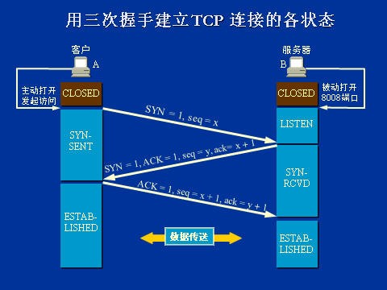
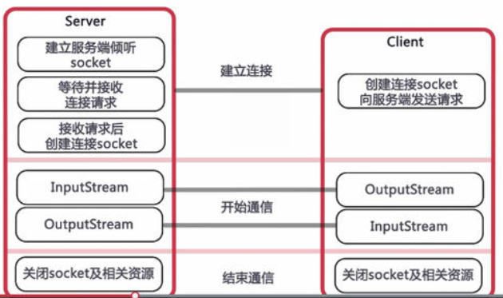
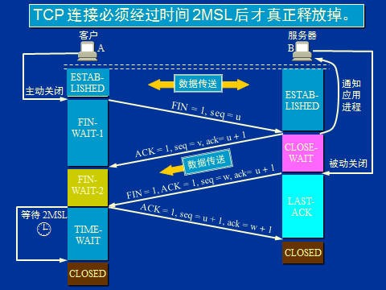
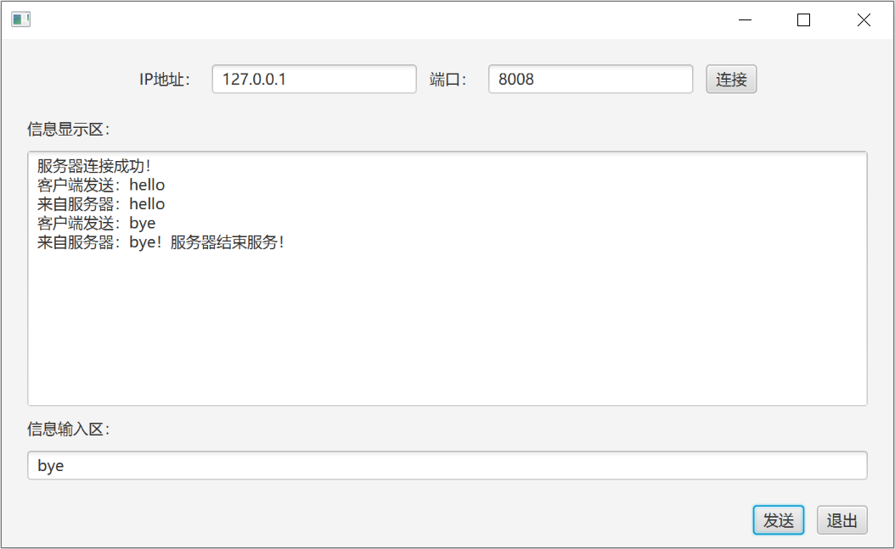

## 第2讲 网络对话程序设计

__教学与实践目的：学会基本的网络对话程序设计。__

### 一、简单网络对话程序
__设计任务：__
客户端向服务器发送字符串，并能读取服务器返回的字符串。

__知识点：__
TCP套接字技术，C/S软件架构程序设计
__重点理解：__
Java客户套接字类Socket和服务器套接字类ServerSocket，
        以及配套使用流的读/写类BuffferedReader/PrintWriter。
在C/S软件架构程序设计技术中,实现网络通信的两个应用进程，一个叫做服务进程，另一个叫做客户进程，如图2.1所示。服务进程首先被动打开一个监听端口，如8008，客户进程主动访问这个端口，完成对话聊天前的TCP三次握手连接。



图2.1 TCP连接建立的过程

Java的TCP/IP 套接字编程将底层的细节进行了封装，其编程模型如图2.2所示。


图2.2 Socket完整通信模型

在Java TCP/IP编程模型中，有两个套接字类：服务进程中的是ServerSocket类，客户进程中的是Socket类。

    服务进程首先开启一个或多个监听端口，客户进程向服务进程发起TCP三次握手连接，分别见附录1、2中的代码。
    TCP连接成功后，逻辑上可理解为通信进程的双方具有两个流（输出流和输入流）。逻辑上可将两个流理解为两个通信管道的全双工通信模式，一个用于向对方发送数据，另一个用于接收对方的数据。

套接字类有两个基本的方法可以获得两个通信管道的入口：
     socket.getInputStream()方法可获得输入字节流的入口地址；
     socket.getOutputStream()方法可获得输出字节流的出口地址；

  功能详细描述：
   客户端程序1：TCPClient.java具有网络接收和发送能力的程序。
   客户端程序2：TCPClientFX.java为界面模块。
   服务器程序：TCPServer.java具有网络接收和发送功能。
 网络对话方式是：
     客户端连接服务器，连接成功后，服务器首先给客户端发送一条欢迎信息；之后客户端程序每发送一条信息给服务器TCPServer.java，服务器接收并回送该信息到客户端，客户端接收并显示该信息；当客户端发送"bye"，则结束对话。
附件中提供TCPClient.java和TCPServer.java源程序，可在自己的机器上运行它。
### 1. 程序设计第一步
新建一个程序包，建议命名为chapter02；
编写并运行TCPServer程序，通过命令行窗口(netstat -ano | findstr "8008")察看是否已开启8008监听端口。
服务器程序需要一直运行，所以处理代码一般放在while(true)这种无限循环中，TCPServer只能运行一次，且自身不能终止运行，要终止它运行，只能通过强制方式（如果通过IDE环境运行，则可以在IDE环境强制关闭）。
### 2. 程序设计第二步
编写并理解TCPCilent.java程序，之后再举一反三，去理解TCPServer.java的代码，理解服务端和客户端如何互动。

#### （1）定义对象构造方法的内容：
```java
socket = new Socket(host,port); //向服务进程发起TCP三次握手连接
```
Socket连接成功后，通过调用socket.getXXXXXStream( )方法，可获得字节输出流和字节输入流，输出流用于发送信息，输入流用于接收信息。并可通过以下组合方式封装为输入输出的字符流：
```java
new PrintWriter( // 设置最后一个参数为true，表示自动flush数据
    new OutputStreamWriter(//设置utf-8编码
        outputStream, "utf-8"), true);
new BufferedReader(
    new InputStreamReader(inputStream, "utf-8"));
```
__注意：__
通过输出流往网络写出数据时，为了将缓存中的所有数据都推送出去，需要在写操作后执行flush命令，PrintWriter可以通过构造方法实现自动flush，所以就不需要显式的执行flush方法。另外，为了避免乱码，输入输出流的编码需要保持一致，为了兼容性，建议使用utf-8编码。
#### （2）定义网络信息发送方法供外部调用：
 ```java
 public void send(String msg) {
  //输出字符流，由Socket调用系统底层函数，经网卡发送字节流
  pw.println(msg);
}
```

#### （3）定义网络信息接收方法供外部调用：
```java
public String receive() {
  String msg = null;
  try {
    //从网络输入字符流中读信息，每次只能接受一行信息
    //如果不够一行（无行结束符），则该语句阻塞，
    // 直到条件满足，程序才往下运行
    msg = br.readLine();
  } catch (IOException e) {
    e.printStackTrace();
  }
  return msg;
}
```

#### （4）定义网络连接关闭方法供外部调用
```java
public void close() {
  try {
if (socket != null) {
      //关闭socket连接及相关的输入输出流,实现四次握手断开，如图2.3所示
      socket.close();
    }
  } catch (IOException e) {
    e.printStackTrace();
  }
}
```


图2.3 TCP连接释放过程

__注意：__
理解TCPCilent程序中的3个思想，如何连接对方，如何发送信息给对方，如何接收对方的信息。
    编写程序可对照参考附录。
### 3. 程序设计第三步
将客户端图形化，内部调用TCPClient模块中相应的方法完成网络对话功能：

创建新界面并命名为TCPClientFX.java程序，其界面布局如图2.4所示。



图2.4 网络对话界面

该窗体界面可参考第一讲SimpleFX的界面设计方法，在其基础上略作修改。例如可以添加一个HBox面板，用于容纳最上一行ip地址、端口输入框及连接按钮等控件，然后把这个HBox添加到主界面中央的VBox中，就可以达到类似图示效果。

---

在“连接”按钮中设置如下动作：
```java
btnConnect.setOnAction(event -> {
  String ip = tfIP.getText().trim();
  String port = tfPort.getText().trim();

  try {
    //tcpClient不是局部变量，是本程序定义的一个TCPClient类型的成员变量
    tcpClient = new TCPClient(ip,port);
    //成功连接服务器，接收服务器发来的第一条欢迎信息
    String firstMsg = tcpClient.receive();
    taDisplay.appendText(firstMsg + "\n");
  } catch (Exception e) {
    taDisplay.appendText("服务器连接失败！" + e.getMessage() + "\n");      
  }
});
```
---
在“退出”按钮中设置如下动作：

```java
btnExit.setOnAction(event -> {
  if(tcpClient != null){
    //向服务器发送关闭连接的约定信息
    tcpClient.send("bye");
    tcpClient.close();
  }
  System.exit(0);
});
```

---

如果用户不是通过退出按钮关闭窗体，而是点击右上角的×关闭，那么不会执行关闭socket的代码，所以可以把上面退出动作的代码封装成一个方法，在窗体关闭响应的事件中也执行，即使用：

```java
primaryStage.setOnCloseRequest(event -> {
  ……
});
```

---

在“发送”按钮中添加网络发送和接收方法：
```java
btnSend.setOnAction(event -> {
  String sendMsg = tfSend.getText();
  tcpClient.send(sendMsg);//向服务器发送一串字符
  taDisplay.appendText("客户端发送：" + sendMsg + "\n");
  String receiveMsg = tcpClient.receive();//从服务器接收一行字符
  taDisplay.appendText(receiveMsg + "\n");
});
```

### 4. 建议
我们可以看出，在一个设计良好的TCP服务器/客户端程序中，为了能够友好地完成整个通信过程，建议：
（1）客户端成功连接服务器，服务器应该给客户端主动发送一条欢迎或通知等信息，作为整个通信的第一条信息，然后服务器进入监听阻塞状态，等待客户端的信息。而客户端在连接成功后就用一条行读取语句来读取这条信息；

（2）服务器一般是不关闭，一直等待客户连接，并不能主动知道客户端是否准备离开。所以客户端关闭时，给服务器发送一条约定的表示离开的信息（在本例中使用bye作为约定信息），以方便服务器可以做出响应。

这两条都需要服务器和客户端互相约定，否则就可能有问题，例如，如果服务器在一个客户端连接成功后，并没有一条欢迎信息发送给客户端，客户端的读取欢迎信息的语句无法读取到内容，就被阻塞住，由于是单线程，甚至整个程序都会被卡住。要解决这个问题，可以使用下一讲的知识。

### 二、课堂计分
先在自己机器上测试运行客户和服务器程序，或者和同学一组互相测试，直到访问对方服务器成功。之后再向老师给定的服务器（172.16.229.253：8008）发送一条你注册的学号、姓名及密码的信息，之间不要留空格，用&隔开，例如：
　　　　　　　　　20170000000007&程旭元&你的密码

 若收到老师服务器回应的“本讲作业已提交，成功完成！”信息，表示本次实验工作完成，下周来实验时可以查看本次成绩。
注意，一台机器只记录一个同学成绩，若有类同的IP地址将全部判为无效。

### 三、扩展练习之一（不计分）
在TCPClientFX客户端窗体程序中，连接成功服务器后，如果用户再次点击“连接”按钮，会造成服务器资源浪费，还可能使程序运行不正常，无法正常发送信息；
没有连接服务器时，或者发送bye以后，点击“发送”按钮，控制台也会产生异常；
请修改程序，避免这种误操作。
提示：一个简单的方案，就是在合适的时候禁用及启用对应的按钮。例如程序启动的时候，发送按钮需要禁用，在连接成功后启用，发送bye后又要再次禁用；用户连接成功后，禁用“连接”按钮，当用户通过按钮发送bye结束通话，重新启用“连接”按钮。Button有个setDisable方法可供使用。

### 四、扩展练习之二（不计分）
这是个娱乐练习，图2.5是个网络搞笑截图，尝试修改你的TCPServer服务端程序，增加一行代码，实现类似功能。


图2.5 “机器人”应答

附录
#### 1. TCPServer.java源文件
```java
package chapter02;

import java.io.*;
import java.net.ServerSocket;
import java.net.Socket;

public class TCPServer {
  private int port = 8008; //服务器监听端口
  private ServerSocket serverSocket; //定义服务器套接字

  public TCPServer() throws IOException {
    serverSocket = new ServerSocket(8008);
    System.out.println("服务器启动监听在 " + port + " 端口");
  }

  private PrintWriter getWriter(Socket socket) throws IOException {
    //获得输出流缓冲区的地址
    OutputStream socketOut = socket.getOutputStream();
    //网络流写出需要使用flush，这里在PrintWriter构造方法中直接设置为自动flush
    return new PrintWriter(
        new OutputStreamWriter(socketOut, "utf-8"), true);
  }

  private BufferedReader getReader(Socket socket) throws IOException {
    //获得输入流缓冲区的地址
    InputStream socketIn = socket.getInputStream();
    return new BufferedReader(
        new InputStreamReader(socketIn, "utf-8"));
  }

  //单客户版本，即每一次只能与一个客户建立通信连接
  public void Service() {
    while (true) {
      Socket socket = null;
      try {
        //此处程序阻塞，监听并等待客户发起连接，有连接请求就生成一个套接字。
        socket = serverSocket.accept();
        //本地服务器控制台显示客户端连接的用户信息
        System.out.println("New connection accepted： " + socket.getInetAddress());
        BufferedReader br = getReader(socket);//定义字符串输入流
        PrintWriter pw = getWriter(socket);//定义字符串输出流
        //客户端正常连接成功，则发送服务器的欢迎信息，然后等待客户发送信息
pw.println("From 服务器：欢迎使用本服务！");

String msg = null;
        //此处程序阻塞，每次从输入流中读入一行字符串
        while ((msg = br.readLine()) != null) {
          //如果客户发送的消息为"bye"，就结束通信
          if (msg.equals("bye")) {
            //向输出流中输出一行字符串,远程客户端可以读取该字符串
            pw.println("From服务器：服务器断开连接，结束服务！");
	System.out.println("客户端离开");
            break; //结束循环
          }
          //向输出流中输出一行字符串,远程客户端可以读取该字符串
          pw.println("From服务器：" + msg);

        }
      } catch (IOException e) {
        e.printStackTrace();
      } finally {
        try {
          if(socket != null)
            socket.close(); //关闭socket连接及相关的输入输出流
        } catch (IOException e) {
          e.printStackTrace();
        }
      }
    }
  }

  public static void main(String[] args) throws IOException{
    new TCPServer().Service();
  }
}
2. TCPClient.java源文件

package chapter02;

import java.io.*;
import java.net.Socket;

public class TCPClient {
  private Socket socket; //定义套接字
  //定义字符输入流和输出流
  private PrintWriter pw;
  private BufferedReader br;

  public TCPClient(String ip, String port) throws IOException {
    //主动向服务器发起连接，实现TCP的三次握手过程
    //如果不成功，则抛出错误信息，其错误信息交由调用者处理
    socket = new Socket(ip, Integer.parseInt(port));

    //得到网络输出字节流地址，并封装成网络输出字符流
    OutputStream socketOut = socket.getOutputStream();
    pw = new PrintWriter( // 设置最后一个参数为true，表示自动flush数据
        new OutputStreamWriter(//设置utf-8编码
            socketOut, "utf-8"), true);

    //得到网络输入字节流地址，并封装成网络输入字符流
    InputStream socketIn = socket.getInputStream();
    br = new BufferedReader(
        new InputStreamReader(socketIn, "utf-8"));
  }

  public void send(String msg) {
    //输出字符流，由Socket调用系统底层函数，经网卡发送字节流
    pw.println(msg);
  }

  public String receive() {
    String msg = null;
    try {
      //从网络输入字符流中读信息，每次只能接受一行信息
      //如果不够一行（无行结束符），则该语句阻塞，
      // 直到条件满足，程序才往下运行
      msg = br.readLine();
    } catch (IOException e) {
      e.printStackTrace();
    }
    return msg;
  }
  public void close() {
    try {
      if (socket != null) {
        //关闭socket连接及相关的输入输出流,实现四次握手断开
        socket.close();
      }
    } catch (IOException e) {
      e.printStackTrace();
    }
  }

}
```

#### 3. 出现Unsupported major.minor version 51.0 错误的解决方案
原因是不同机器之间的JDK版本不一致造成的，解决的办法比较复杂，因实验室环境问题，一个简单办法，就是新建一个项目，将你的源程序拷贝到新项目中去运行。
